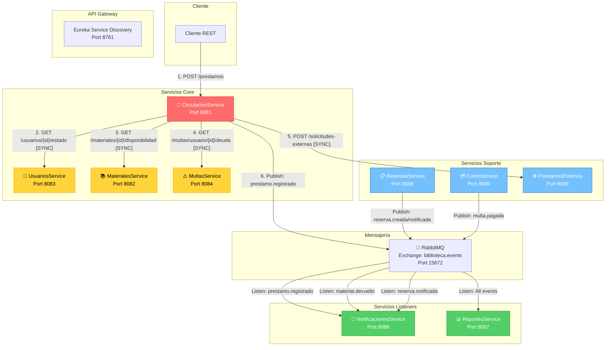
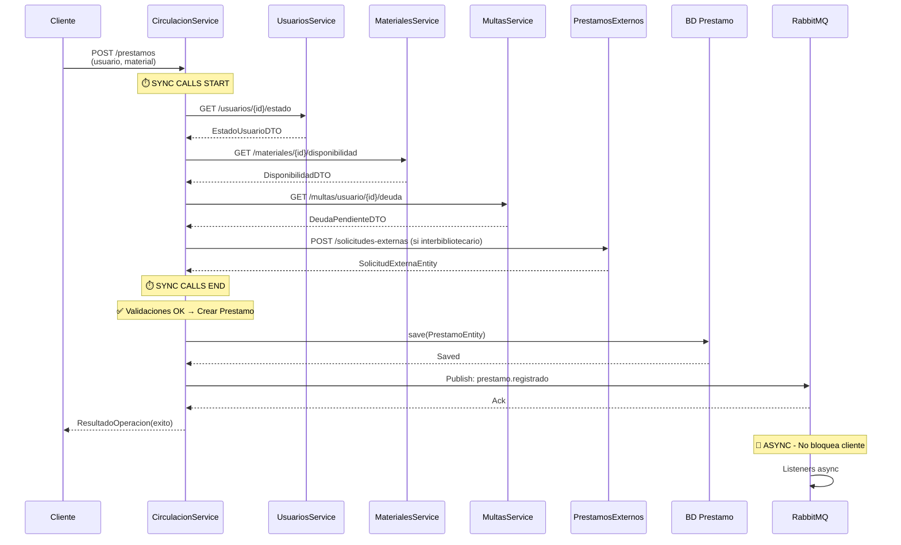
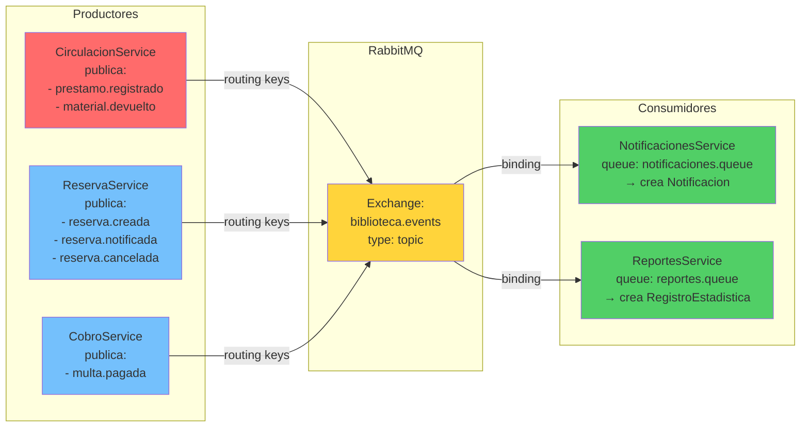
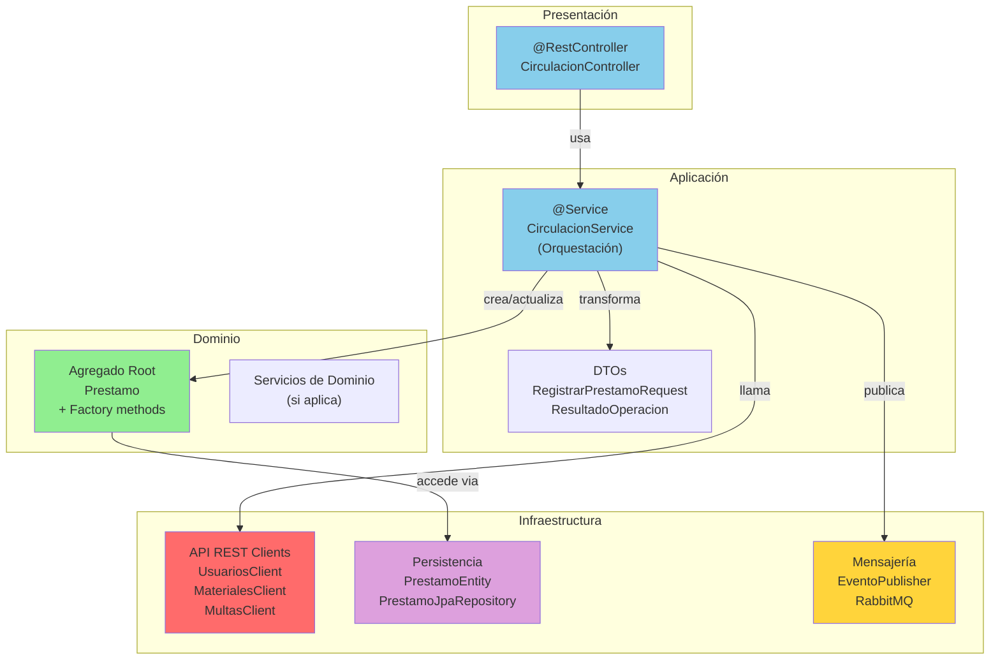
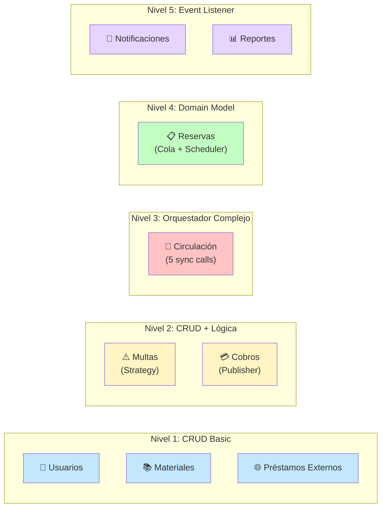
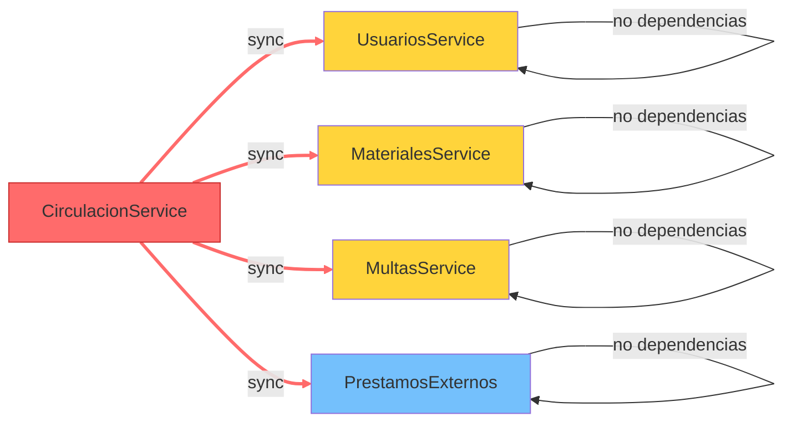
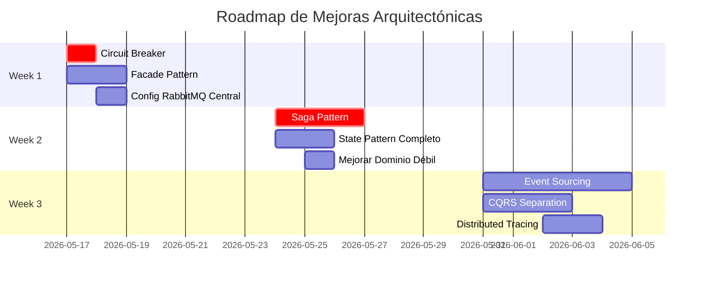

# Diagrama de Arquitectura - Microservicios Biblioteca

## Comunicación Inter-Servicios



## Flujo de Registrar Préstamo (CRÍTICO - 🔴)



## Arquitectura de Base de Datos

```mermaid
graph LR
    subgraph "Usuarios Service"
        UDB["usuarios_bd<br/>UsuarioEntity"]
    end
    
    subgraph "Materiales Service"
        MDB["materiales_bd<br/>MaterialEntity"]
    end
    
    subgraph "Circulacion Service"
        CDB["circulacion_bd<br/>PrestamoEntity"]
    end
    
    subgraph "Multas Service"
        MuDB["multas_bd<br/>MultaEntity"]
    end
    
    subgraph "Cobros Service"
        CoDBP["cobros_bd<br/>RegistroPagoEntity<br/>DeudaPendienteEntity"]
    end
    
    subgraph "Reservas Service"
        RDB["reservas_bd<br/>ReservaEntity"]
    end
    
    subgraph "Notificaciones Service"
        NDB["notificaciones_bd<br/>NotificacionEntity"]
    end
    
    subgraph "Reportes Service"
        ReDB["reportes_bd<br/>RegistroEstadisticaEntity"]
    end
    
    Note: Database per Service (Poliglota)
```

## Flujo de Eventos (RabbitMQ)



## Patrón de Capas en Cada Servicio



## Estado de Madurez por Servicio



## Matriz de Dependencias Síncronas



## Problemas de Diseño Actuales

```
┌─────────────────────────────────────────────────────────────────┐
│                    ARQUITECTURA ACTUAL                           │
├─────────────────────────────────────────────────────────────────┤
│                                                                  │
│  🔴 CRÍTICO                                                     │
│  ├─ Sincronía cascada: CS → US → MS → MuS → PS                │
│  ├─ Sin Circuit Breaker → timeout = request bloqueado          │
│  ├─ Sin Saga pattern → transacciones inconsistentes            │
│  └─ Cascada de fallos → 1 servicio down = todo down            │
│                                                                  │
│  🟡 MODERADO                                                    │
│  ├─ Sin Facade pattern (organización interna débil)            │
│  ├─ State pattern incompleto (enums vs objetos)                │
│  ├─ Dominio débil en: RegistroPago, Notificacion              │
│  └─ RabbitMQ config dispersa (duplicación)                     │
│                                                                  │
│  🟢 MENOR                                                       │
│  ├─ Sin Builder pattern en DTOs                                │
│  ├─ Sin garantía de delivery en async (fire-forget)           │
│  └─ Logging distribuido faltante                               │
│                                                                  │
└─────────────────────────────────────────────────────────────────┘
```

## Mejoras Recomendadas (Roadmap)



