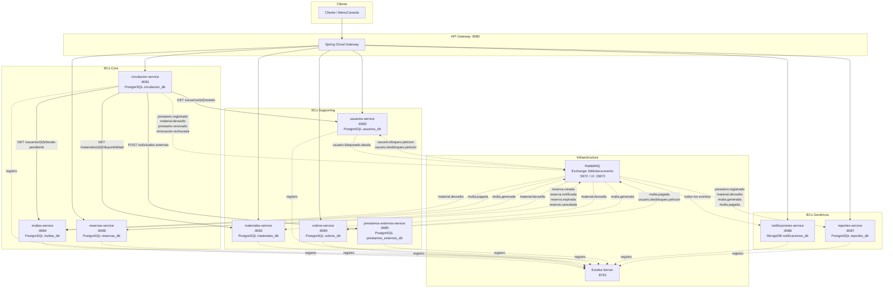
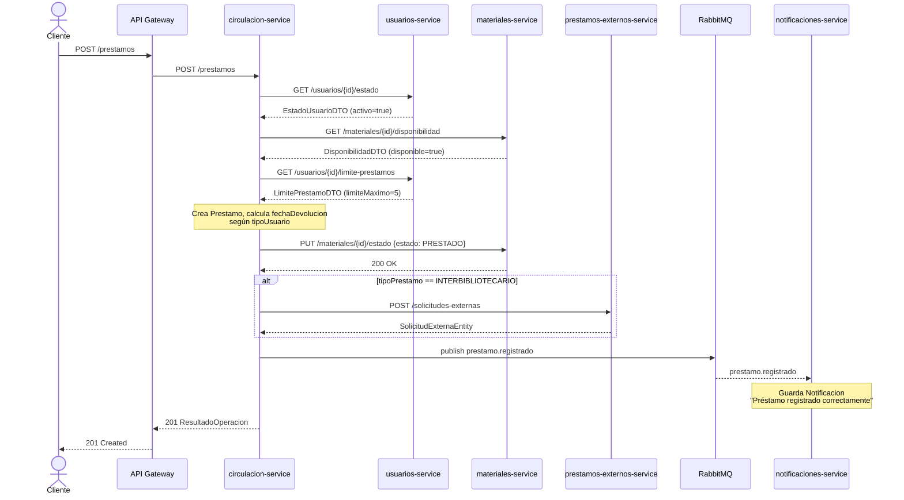
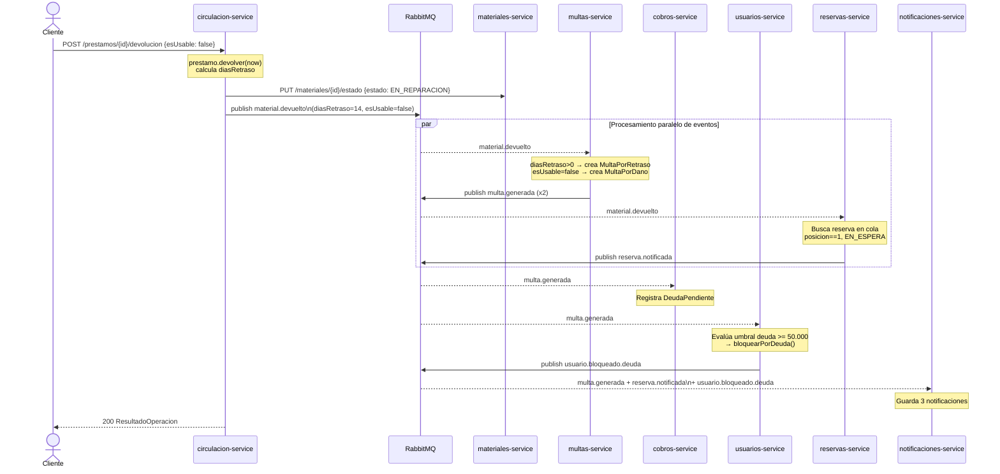
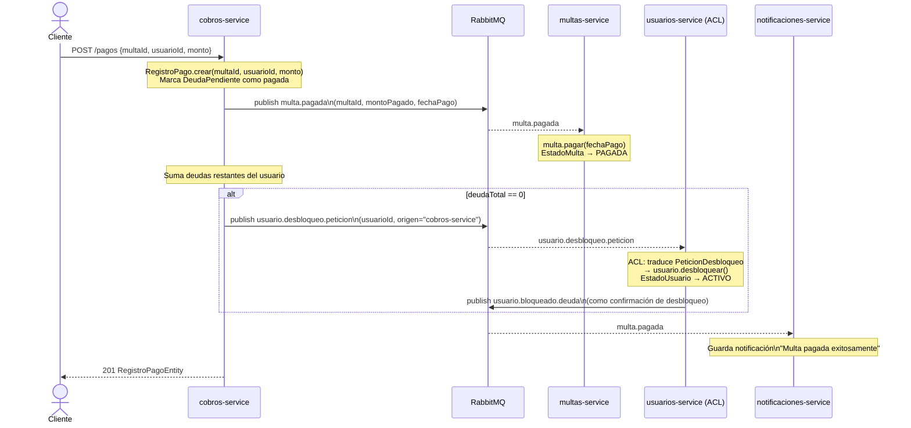
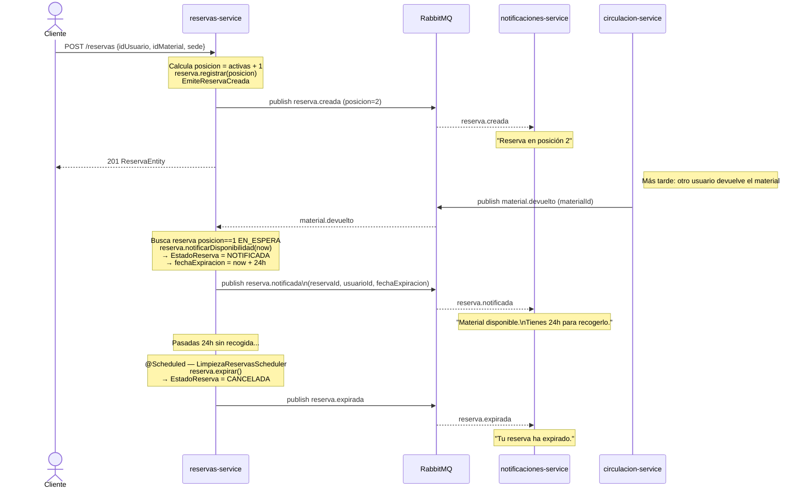
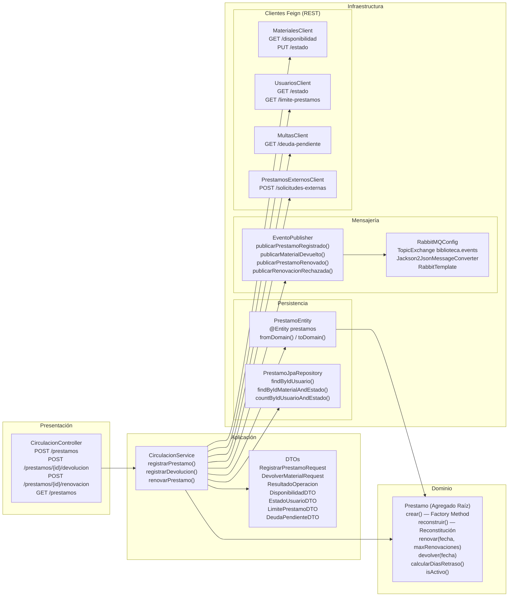

# Fase 4 — Diagramas de Arquitectura

Todos los diagramas están en formato **Mermaid** (copiar directo a mermaid.live o cualquier editor compatible).

---

## Diagrama 1 — Contexto de Microservicios

Línea sólida `-->` = comunicación síncrona (REST/Feign).  
Línea punteada `-.->` = comunicación asíncrona (RabbitMQ).

---

## Diagrama 2a — Flujo: Registro de Préstamo

---

## Diagrama 2b — Flujo: Devolución con Multa y Bloqueo

---

## Diagrama 2c — Flujo: Pago de Multa y Desbloqueo

---

## Diagrama 2d — Flujo: Creación de Reserva y Notificación de Disponibilidad

---

## Diagrama 3 — Capas DDD: circulacion-service

